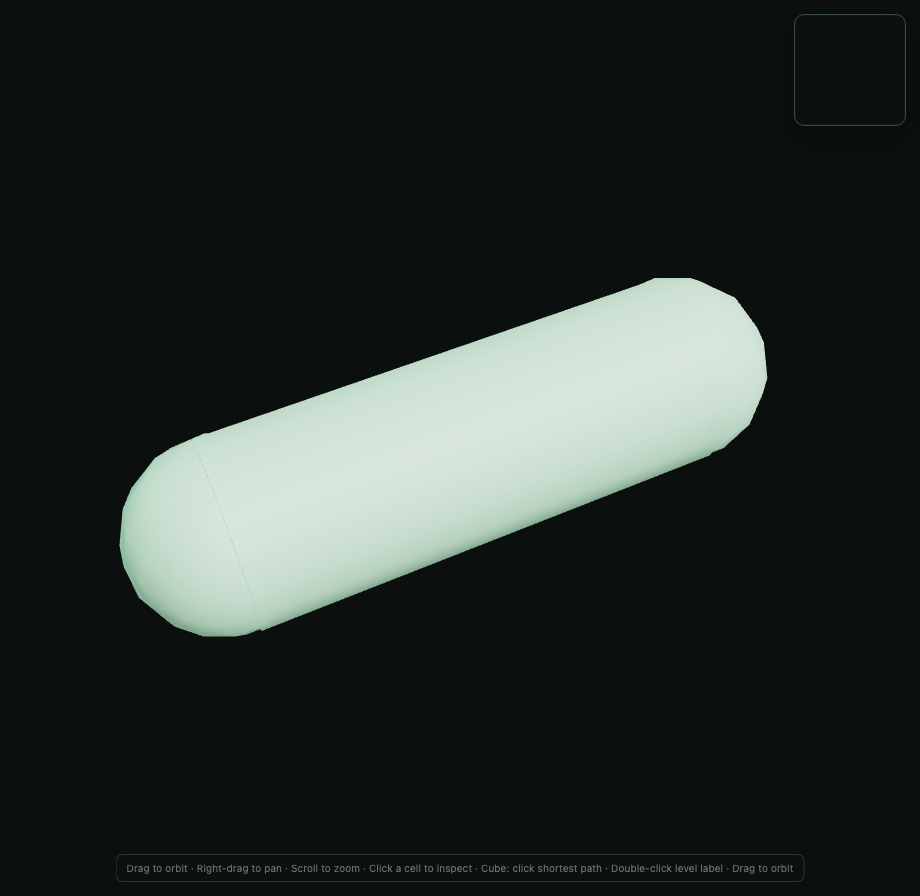
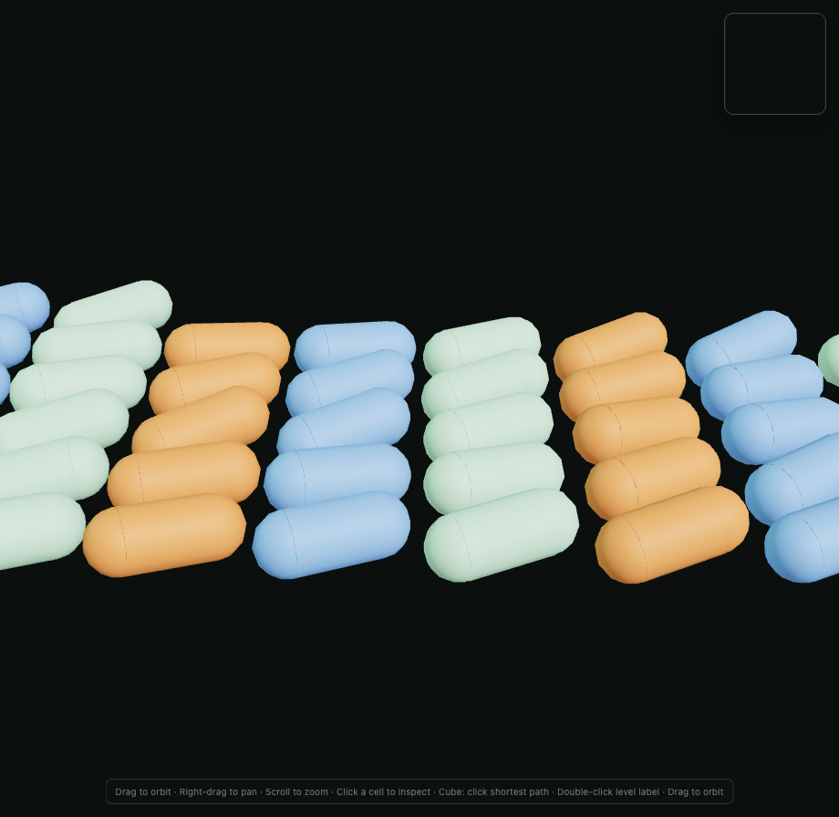

# Capsule rendering validation

The previous renderer (`b69193b9`) combined a closed cylinder with two complete spheres. The sphere tessellation remained in world orientation while the cylinder followed the cell direction. Their polygonal boundaries did not coincide, and the cylinder end disks intersected the spherical surfaces. The resulting narrow lines at the cap joins are visible in the baseline screenshots below.

The replacement uses an open cylinder and two hemispheres, all sharing the cell orientation. Both hemispherical equators use the cylinder's exact radial samples and normals. Radius scales the caps uniformly; cylindrical length scales only the cylinder and displaces cap centers. The selection wireframe uses these same surfaces with an 8% radius expansion. Zero centerline length collapses the cylinder and joins two hemispheres into a sphere.

## Identical-camera comparisons

These are unmodified screenshots from `viewer/browser/capsules.mjs`, using the same geometry fixtures, camera, lights, colors, browser, and viewport. The baseline renderer was recorded before the implementation changed. Neither image comes from a different simulation trajectory.

| Fixture | Before | After |
| --- | --- | --- |
| Isolated rod, arbitrary 3D direction |  |  |
| Dense colony, near view |  |  |

The cap-join lines disappear at the same camera positions in the near and distant fixtures. The browser harness also records 48 frames of prescribed changes in position and orientation, so the surface can be inspected during movement. Silhouette tessellation, pixel aliasing, and real motion remain possible; this change does not smooth simulation state or claim to eliminate every source of shimmer.

## Geometry and interaction checks

The Vitest geometry suite checks matched seam positions/normals, outward-facing hemisphere triangles, absence of cylinder end disks, constant distance from the centerline segment, exact axial extents, conservative bounds, arbitrary directions, and zero-length cells. It also ray-picks both capsule tips with real Three.js instanced meshes and checks selection-radius inflation. The browser harness exercises color attributes on every mesh, pointer picking, stable-ID selection through reordered frames and removal, actual selected-overlay surface positions, and a selected zero-length sphere. The largest measured overlay-surface error in the browser fixture was `1.29e-8` world units.

## Local rendering and resource measurements

Both comparisons ran on macOS in headless Chromium `153.0.8010.12`, with the same browser launch configuration. The corrected run reports ANGLE/Vulkan SwiftShader: these are **software WebGL measurements**, not physical GPU performance results. The fixture uses 512 cells, ten warmup frames, and 60 measured complete frame replacements, including transforms, coloring, rendering, and `gl.finish()` synchronization. Small timing differences are within local measurement noise.

| Measurement | Before | After |
| --- | ---: | ---: |
| Instanced draw calls for the colony | 3 | 3 |
| Shared geometry vertices (cylinder + both caps) | 388 | 400 |
| Triangles per cell | 504 | 576 |
| Triangles for 512 cells | 258,048 | 294,912 |
| Median replacement/render time | 2.2 ms | 2.1 ms |
| p95 replacement/render time | 2.4 ms | 2.4 ms |
| Renderer geometry count at both sampled frames | 4 | 4 |
| Tracked live WebGL buffers across 59 replacements | 390 → 744 | 18 → 18 |
| Tracked buffers after an empty frame | 732 | 0 |

The geometry count alone concealed an existing resource leak: removing an instanced mesh and disposing its geometry did not release `instanceMatrix` and `instanceColor` buffers. Frame replacement now calls `InstancedMesh.dispose()` as well as disposing each shared geometry/material once. Browser instrumentation observes actual WebGL buffer creation/deletion; buffers remain bounded across replacements and return to zero after clearing the colony and disposing the viewer.

The modest tessellation change (24 radial samples and six rows per hemisphere) improves silhouettes, but it is not the basis for the seam fix: the tests verify the changed surface topology and exact equator agreement. For reproduction commands, fixture details, videos, and resource assertions, see [the browser harness instructions](../viewer/browser/README.md).
