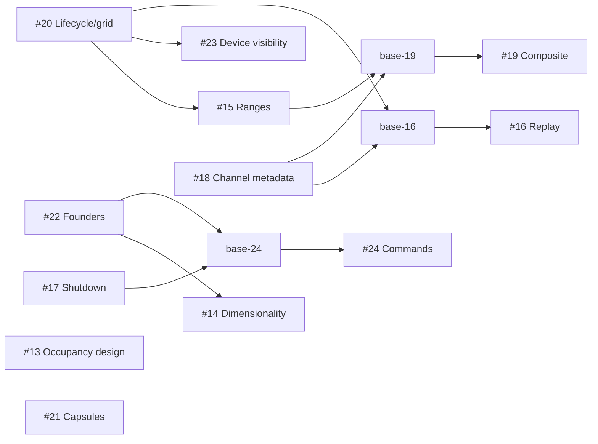

# Luiza feedback contribution campaign

The campaign uses one issue branch and worktree per issue, numbered `marpaia/13` through `marpaia/24`. Pull requests preserve their intended review boundaries. `marpaia/feedback-integration` combines completed contributions for cross-feature validation; it is not a pull-request target and has not been merged into master.

## Review units

| Issue | Contribution | Pull request | Review base |
| --- | --- | --- | --- |
| #13 | Extracellular occupancy design and conservative reference | [#31](https://github.com/DRAGGON-Lab/MicroSimulator/pull/31) | `master` |
| #14 | Out-of-plane diagnosis and dimensionality contract | [#35](https://github.com/DRAGGON-Lab/MicroSimulator/pull/35) | `marpaia/22` |
| #15 | Persistent scalar color ranges | [#30](https://github.com/DRAGGON-Lab/MicroSimulator/pull/30) | `marpaia/20` |
| #16 | Offline checkpoint replay | [#33](https://github.com/DRAGGON-Lab/MicroSimulator/pull/33) | `marpaia/base-16` |
| #17 | Cooperative Stop and port reuse | [#34](https://github.com/DRAGGON-Lab/MicroSimulator/pull/34) | `master` |
| #18 | Channel metadata and safe scene loading | [#28](https://github.com/DRAGGON-Lab/MicroSimulator/pull/28) | `master` |
| #19 | Composite species coloring | [#32](https://github.com/DRAGGON-Lab/MicroSimulator/pull/32) | `marpaia/base-19` |
| #20 | Dataset lifecycle and stable reference grid | [#27](https://github.com/DRAGGON-Lab/MicroSimulator/pull/27) | `master` |
| #21 | Continuous capsules and GPU resource cleanup | [#36](https://github.com/DRAGGON-Lab/MicroSimulator/pull/36) | `master` |
| #22 | Founder initialization at division thresholds | [#26](https://github.com/DRAGGON-Lab/MicroSimulator/pull/26) | `master` |
| #23 | Device geometry visibility | [#29](https://github.com/DRAGGON-Lab/MicroSimulator/pull/29) | `marpaia/20` |
| #24 | Executed backend and shell command documentation | [#37](https://github.com/DRAGGON-Lab/MicroSimulator/pull/37) | `marpaia/base-24` |

## Dependency graph

The frozen prerequisite branches are `marpaia/base-16` at `d65f848334a18a73c4405b5563e94b435b23795b`, `marpaia/base-19` at `b0f98ee9187514d92adc562f383796ea6f41db0f`, and `marpaia/base-24` at `f2c17902089d3987a247a0131ada74c0402174b3`. They remain fixed so later integration cannot consume or erase a contribution's review diff. Subsequent fixes to prerequisite issue branches are tested on the combined validation branch and must be included when dependent contributions are rebased for landing.

## Landing order

Review the independent contributions #13, #17, #18, #20, #21 and #22 first. Once those prerequisites land, update #14, #15, #16, #23 and #24 onto current master and retarget their pull requests. Update #19 after #15 and #18 have landed. Review and test each resulting diff against master, particularly shared viewer wiring, documentation and scene compatibility. If prerequisites are squash-merged, transplant only the issue-specific commits after the recorded review base; do not replay the entire prerequisite stack.

When resolving the stacked changes, retain all feature wiring in `viewer/src/main.ts` and `viewer/src/colony-viewer.ts`, the combined stylesheet sections, and the documentation index entries. The validation branch demonstrates these resolutions. Also retain the link from the #14 planarity tutorial to the #24 shell command guide, and carry the combined browser fixtures/regression script into the final assembled tree. Browser observation hooks must accept Vite module query strings. Run the combined browser regression after the final stack is assembled.

Only issue pull requests should be merged. The frozen bases and moving validation branch are review/verification artifacts. Master was `b69193b9db034b4ccd484920de3068cc11c3ea2d` when this campaign began and has not been modified by the campaign.

## Scope and verification boundaries

Issue #13 is the requested numerical design plus an executable conservative reference, not a production occupancy solver. Issue #14 is a completed stage-level diagnosis and tutorial audit; no solver defect was demonstrated, and strict planar mechanics remains a separately specified follow-up. Those outcomes match their issue acceptance criteria.

The combined browser workflow uses actual native checkpoint export and verifies replay with fixed species/signal ranges, composite tint/order/enabled preferences, device visibility, stable cell identity, camera and reference-grid retention, missing/reappearing grids/devices, rapid/backward seeks, error recovery and keyboard/narrow-layout behavior. Its fixtures and invocation are in [viewer/browser/README.md](../../viewer/browser/README.md#combined-feedback-campaign).

Native tests use CPU and available Apple Metal. CUDA compile checks establish build portability; no NVIDIA runtime/application execution is claimed. Chromium visual tests use SwiftShader software WebGL, so their timings do not establish physical GPU performance. Recorded legacy-source tests requiring `CM_LEGACY_ROOT` remain skipped when the external reference checkout is absent. Windows CPU CI exercises shutdown, real console interruption and command examples; manual terminal-specific keyboard configuration remains an environment check.

## Validated source snapshot

The following issue heads were combined on 2026-09-24. The complete Python suite ran at `6abce50656fef625d4612d6ffc42f4a878d4fff6`; the subsequent merge at `9704466b154a3a9b07d90eda5095523f599b586b` changes only formatting in three test blocks, verified to preserve the Python AST. No native C++ code changed in this campaign. Each worktree built its own native extension, and the combined environment was built independently.

| Issue | Head |
| --- | --- |
| #13 | `4ccef4f3a95f02b810fa18eb76b75e0e9ff7a80e` |
| #14 | `63adb45c02f79f045df35539164385c0e8290af0` |
| #15 | `e96672c4e8e40a827e04a7ae95dcf9e3f27cca2d` |
| #16 | `3ccd5a6656a127159a42d034ddc7367167136779` |
| #17 | `b50c72d78e84555fa050849721113897f22ed255` |
| #18 | `ae428e5dae170e3e58b54804c3b39b90c07f63bf` |
| #19 | `9a27f8714de8515d6cb31a0b37ab5d1ce3bfa0c2` |
| #20 | `2a6bdc0340994afb1c6fe8b6d9f92ecc11257c18` |
| #21 | `178143550dc11f63689f8eba5b412146224b7aea` |
| #22 | `2d30fc7fde33abe06ddf0b05910c09d7d594e3f7` |
| #23 | `c1cb4d6fd20d0f0ca5f5bb59f3164413e4ca1f97` |
| #24 | `5e1fdecb404feb89f82e75cea698f870fb70e37d` |

## Verification results

All 12 open issue PRs have passing hosted CUDA compilation checks on their recorded heads. Both shutdown PR workflows also pass on the final PR states. These hosted compilation results do not claim NVIDIA execution.

- Full combined Python suite: **532 passed, 57 skipped in 36.81 seconds**. Executed available CPU and Apple Metal backends, checkpoint migrations/integrity, reference conservation cases, founder initialization, stage diagnostics, server lifecycle, replay export and exact tutorial commands. Skips identify unavailable backends or external legacy-source inputs; they are not passes.
- Combined viewer suite: **111 tests passed** across 13 files. Strict TypeScript and the Vite production build passed. The existing bundle-size warning remains: approximately 646 kB minified, 167 kB compressed.
- Python Ruff lint passed for the full `python` tree; strict Pyright reported zero errors and one existing native-extension source-stub warning in `flow_reference.py`. Viewer Prettier passed. Repository-wide Python formatting still reports preexisting layout differences; new test blocks were formatted without unrelated source churn. Diff whitespace checks passed.
- Actual Chromium 153 combined replay passed on the final scene parser: native exported growth/division/removal, fixed species and signal scales, composite tint/order/enabled preferences, hidden device geometry, stable-ID selection, missing/returning grids and devices, camera/grid retention, backward and rapid seeking, Play during a pending seek, physical time, malformed-frame attribution/recovery, keyboard navigation, narrow layout and new-dataset defaults. The channel-label browser check also passed after the resource-budget fix.
- Individual Chromium checks passed for scalar RGB and signal texture pixels, composite linear-RGB mixing, all four constraint visibility types, reference-grid stability, channel names, live Stop/reconnect/checkpoint/SIGINT, and corrected capsule geometry. Capsule verification recorded three draws, 294,912 triangles and 18 tracked buffers remaining stable across replacement and returning to zero on clear/dispose. These observations use software WebGL.
- Scene resource regressions authenticate v2/v3 input and reject tiny documents claiming 4097 or uint32-max channels before expanding labels. Both independent channel groups accept 4096 inclusively. Native checkpoint restoration retains compact unnamed metadata and successfully restores 4097 species; the scene limit does not change native counts.
- The corrected replay state machine passes six additional regressions for pending/failed seek versus Play, preventing a restart from the wrong displayed index and ensuring failed requests are retried.
- Literal tutorial command tests executed sh, Bash, Zsh and PowerShell on macOS, including CPU and Metal introductory runs, quoted JSON and paths with spaces, exact CPU resume equality and 12 real server Stop/restart launches. CUDA unavailability produced the documented error.
- [Actual Windows shutdown validation](https://github.com/DRAGGON-Lab/MicroSimulator/actions/runs/36065660876) passed 28 tests. [Actual Windows tutorial-command validation](https://github.com/DRAGGON-Lab/MicroSimulator/actions/runs/36068841367) passed four PowerShell command/cleanup checks plus 28 shutdown checks at `215e87d`; the final #24 commit records these results without changing commands. See [the platform record](tutorial-command-validation.md).

The browser invocation and fixture exporter are documented in [the browser README](../../viewer/browser/README.md#combined-feedback-campaign). Run `uv run pytest -q` from the combined repository, and `pnpm test`, `pnpm build`, and `pnpm format:check` from `viewer` for the automated suites. Exact tutorial command tests require their claimed shells and an available local port 8765. Run live browser checks separately from those tests so they do not compete for ports.

Local evidence is retained under `/private/tmp/microsimulator-swarm/evidence`, including `combined-python-tests-final.xml`, `combined-browser`, `combined-channel-labels`, individual browser result directories, per-issue acceptance maps, and downloaded Windows workflow artifacts. These machine-local paths are not repository dependencies. Hosted workflow links and committed regression scripts make the principal checks independently repeatable.

## Separate existing behavior found during review

A read-only review identified a possible selection jump after a roll-preserving ViewCube snap: the existing pointer-down handler restores world-up before pointer-up raycasting. A numerical projection probe reproduced a 15-degree camera change for one orientation. The relevant camera handlers and `view-cube.ts` are unchanged from master, and this was not reproduced through a browser interaction during this campaign. A future focused regression should fit, single-click Right, wait, then select an off-center cell while asserting a stable camera pose. This observation is recorded separately from campaign regressions; no additional issue was created.

## Subsequent independent review

The [independent review round](feedback-review.md) records acceptance maps for all 12 contributions, two reproduced and corrected defects, separate re-review verdicts, updated heads and subsequent combined validation. The source and results above remain the original campaign snapshot.
